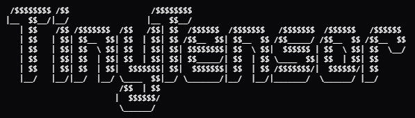

<p align="center">
  
  <p align="center">a tiny tensor computation library</p>
</p>

## What is TinyTensor?
TinyTensor is a lightweight tensor library written from scratch in pure C, focused on building the core foundations of deep learning frameworks.
It provides basic tensor structures, memory handling, and essential operations with a minimal and educational design.


## DType supported
| DType      |      Description      | CPU | CUDA |
|------------|-----------------------|-----|------|
|`int8`      | 8bit signed integer   | ✅  |  ✅  |
|`uint8`     | 8bit unsigned integer | ✅  |  ✅  |
|`int16`     | 16bit signed integer  | ✅  |  ✅  |
|`uint16`    | 16bit unsigned integer| ✅  |  ✅  |
|`int32`     | 32bit signed integer  | ✅  |  ✅  |
|`uint32`    | 32bit unsigned integer| ✅  |  ✅  |
|`int64`     | 64bit signed integer  | ✅  |  ✅  |
|`uint64`    | 64bit unsigned integer| ✅  |  ✅  |
|`float16`   | 16bit floating point  | ✅  |  ✅  |
|`float32`   | 32bit floating point  | ✅  |  ✅  |
|`float64`   | 64bit floating point  | ✅  |  ✅  |
|`float128`  | 128bit floating point | ❌  |  ❌  |
|`complex64` | 64bit complex dtype   | ✅  |  ✅  |
|`complex128`| 128bit complex dtype  | ✅  |  ✅  |
|`complex256`| 256bit complex dtype  | ❌  |  ❌  |

## Install from the source
```bash
git clone https://github.com/0xhilSa/tinytensor
cd tinytensor
bash build.sh
```

## Testing
```python3
import tinytensor as tt

x = tt.Tensor([[1,2,3,4],[5,6,7,8]], dtype=tt.dtypes.int8, device="cpu", const=True)
y = tt.Tensor([[1,2,3,4],[5,6,7,8]], dtype=tt.dtypes.int8, device="cuda", const=True)
print("=====on CPU=====")
print(x)
print(x.buf)
print(x.device)
print("=====on CUDA=====")
print(y)
print(y.buf)
print(y.device)
```
or simply run `pytest -v`

## Requirements
- GCC / Clang
- CUDA Toolkit (for GPU support)
- Python ≥ 3.9
- Linux environment

## Contributions
Pull requests are welcome.
If you find a bug or want to suggest an operation, feel free to open an issue.

## LICENSE
[MIT](./LICENSE)
